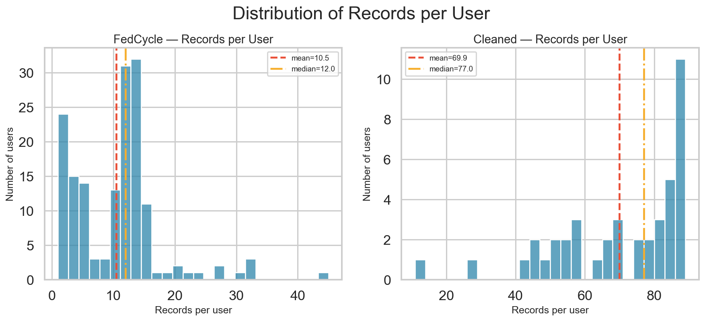
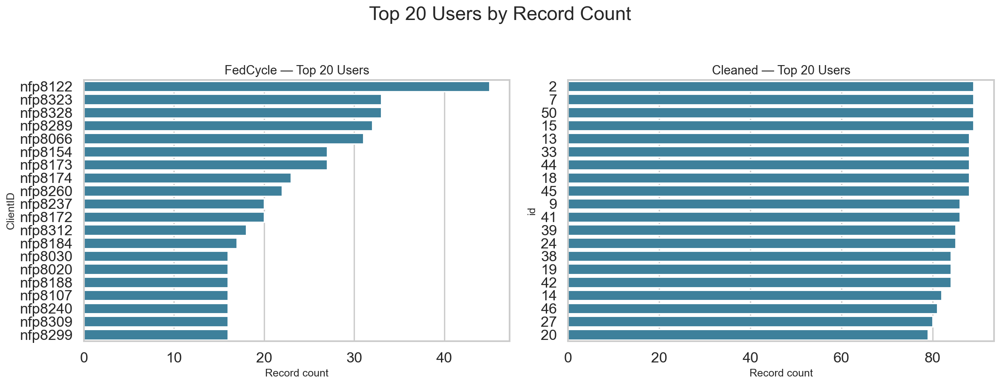
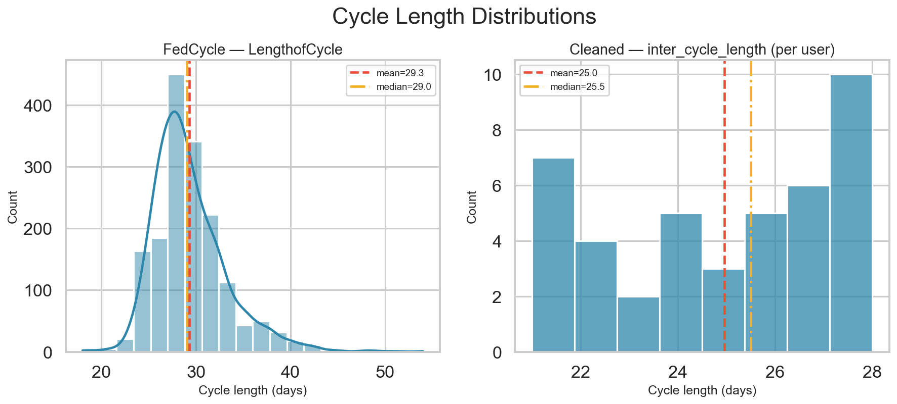
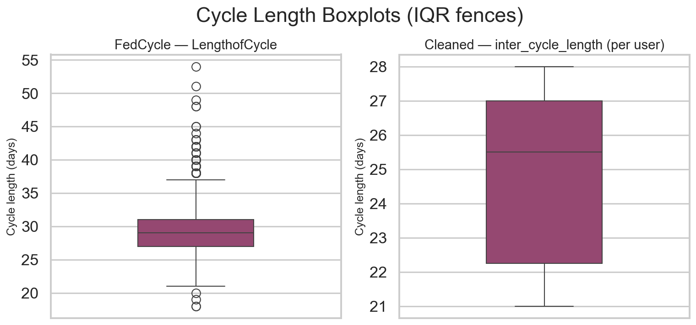

# EDA Phase 1 — User and Cycle Analysis

**Project:** CycleInsight (Menstrual Intelligence System)  
**Scope:** User structure and cycle-length structure only (no ML modeling)  
**Datasets:** `FedCycleData071012.csv`, `cleaned_dataset.csv`

---

## 1. Dataset Overview

### FedCycleData071012.csv
- **Rows:** 1,665
- **Columns:** 80
- **Grain:** one row ≈ one menstrual cycle per client
- **User key:** `ClientID`
- **Primary cycle-length column:** `LengthofCycle`

| dtype | count |
|-------|-------|
| `object` | 75 |
| `int64` | 5 |

### cleaned_dataset.csv
- **Rows:** 2,937
- **Columns:** 72
- **Grain:** one row ≈ one study day per participant
- **User key:** `id`
- **Primary cycle-length column:** `inter_cycle_length` (also `cycle_variability`)

| dtype | count |
|-------|-------|
| `object` | 31 |
| `float64` | 23 |
| `int64` | 18 |

---

## 2. User Analysis

### FedCycle (`ClientID`)
| metric | value |
|--------|-------|
| Unique users | 159 |
| Total records | 1,665 |
| Average records / user | 10.47 |
| Median records / user | 12.0 |
| Minimum records / user | 1 |
| Maximum records / user | 45 |

#### Top 20 users by record count
| rank | ClientID | records |
|------|----------|---------|
| 1 | `nfp8122` | 45 |
| 2 | `nfp8323` | 33 |
| 3 | `nfp8328` | 33 |
| 4 | `nfp8289` | 32 |
| 5 | `nfp8066` | 31 |
| 6 | `nfp8154` | 27 |
| 7 | `nfp8173` | 27 |
| 8 | `nfp8174` | 23 |
| 9 | `nfp8260` | 22 |
| 10 | `nfp8237` | 20 |
| 11 | `nfp8172` | 20 |
| 12 | `nfp8312` | 18 |
| 13 | `nfp8184` | 17 |
| 14 | `nfp8030` | 16 |
| 15 | `nfp8020` | 16 |
| 16 | `nfp8188` | 16 |
| 17 | `nfp8107` | 16 |
| 18 | `nfp8240` | 16 |
| 19 | `nfp8309` | 16 |
| 20 | `nfp8299` | 16 |

### Cleaned (`id`)
| metric | value |
|--------|-------|
| Unique users | 42 |
| Total records | 2,937 |
| Average records / user | 69.93 |
| Median records / user | 77.0 |
| Minimum records / user | 11 |
| Maximum records / user | 89 |

#### Top 20 users by record count
| rank | id | records |
|------|----------|---------|
| 1 | `2` | 89 |
| 2 | `7` | 89 |
| 3 | `50` | 89 |
| 4 | `15` | 89 |
| 5 | `13` | 88 |
| 6 | `33` | 88 |
| 7 | `44` | 88 |
| 8 | `18` | 88 |
| 9 | `45` | 88 |
| 10 | `9` | 86 |
| 11 | `41` | 86 |
| 12 | `39` | 85 |
| 13 | `24` | 85 |
| 14 | `38` | 84 |
| 15 | `19` | 84 |
| 16 | `42` | 84 |
| 17 | `14` | 82 |
| 18 | `46` | 81 |
| 19 | `27` | 80 |
| 20 | `20` | 79 |

---

## 3. Cycle Analysis

### Identified cycle-length columns

| dataset | columns | notes |
|---------|---------|-------|
| FedCycle | `LengthofCycle`, `MeanCycleLength` | `LengthofCycle` is per-cycle; `MeanCycleLength` is sparse (populated mainly on a user's first recorded cycle) |
| Cleaned | `inter_cycle_length`, `cycle_variability` | `inter_cycle_length` is constant per user in this file; analyzed at **user level** to avoid day-row inflation |

### Descriptive statistics — FedCycle `LengthofCycle`
| n | mean | median | std | min | max |
|---|------|--------|-----|-----|-----|
| 1665 | 29.30 | 29.00 | 3.89 | 18.00 | 54.00 |

### Descriptive statistics — FedCycle `MeanCycleLength` (non-null only)
| n | mean | median | std | min | max |
|---|------|--------|-----|-----|-----|
| 141 | 29.55 | 29.50 | 3.05 | 24.00 | 40.00 |

### Descriptive statistics — Cleaned `inter_cycle_length` (per user)
| n | mean | median | std | min | max |
|---|------|--------|-----|-----|-----|
| 42 | 24.95 | 25.50 | 2.61 | 21.00 | 28.00 |

### Descriptive statistics — Cleaned `inter_cycle_length` (all day-rows, for reference)
| n | mean | median | std | min | max |
|---|------|--------|-----|-----|-----|
| 2937 | 24.86 | 25.00 | 2.55 | 21.00 | 28.00 |

### Descriptive statistics — Cleaned `cycle_variability` (day-rows)
| n | mean | median | std | min | max |
|---|------|--------|-----|-----|-----|
| 2937 | 3.02 | 3.03 | 1.15 | 1.00 | 5.00 |

### IQR outlier detection

**FedCycle `LengthofCycle`**
- Q1 = 27.00, Q3 = 31.00
- Lower fence = 21.00, Upper fence = 37.00
- **Outliers:** 73 values — [18, 19, 20, 38, 39, 40, 41, 42, 43, 44, 45, 48, 49, 51, 54]

**Cleaned `inter_cycle_length` (per user)**
- Q1 = 22.25, Q3 = 27.00
- Lower fence = 15.12, Upper fence = 34.12
- **Outliers:** 0 values — none

---

## 4. Visualizations

All figures are saved under `reports/figures/`:

| figure | file |
|--------|------|
| Histogram — records per user | `eda1_records_per_user_hist.png` |
| Histogram — cycle length | `eda1_cycle_length_hist.png` |
| Boxplot — cycle length | `eda1_cycle_length_boxplot.png` |
| Bar chart — top 20 users | `eda1_top20_users_bar.png` |

---

## 5. Data Quality Checks

### Impossible / suspicious cycle lengths
Clinical reference used in this audit:
- **Suspicious / extreme:** < 15 or > 60 days
- **Outside typical plausible range:** < 21 or > 45 days

| check | dataset | count | detail |
|-------|---------|-------|--------|
| Extreme / impossible | FedCycle | 0 | values: none |
| Outside plausible [21, 45] | FedCycle | 9 | value→count: {18: 2, 19: 1, 20: 1, 48: 2, 49: 1, 51: 1, 54: 1} |
| Outside plausible [21, 45] | Cleaned (per user) | 0 | values: none |
| Missing `LengthofCycle` | FedCycle | 0 | — |
| Missing `inter_cycle_length` | Cleaned | 0 | — |
| IQR outliers | FedCycle | 73 | see §3 |
| IQR outliers | Cleaned (per user) | 0 | see §3 |

### Users with extremely low record counts (< 3)

| dataset | n users | users (id → records) |
|---------|---------|----------------------|
| FedCycle | 24 | `{'nfp8281': 2, 'nfp8050': 2, 'nfp8034': 2, 'nfp8047': 2, 'nfp8189': 2, 'nfp8207': 2, 'nfp8085': 2, 'nfp8218': 2, 'nfp8248': 2, 'nfp8286': 2, 'nfp8209': 2, 'nfp8230': 2, 'nfp8254': 2, 'nfp8049': 1, 'nfp8200': 1, 'nfp8144': 1, 'nfp8252': 1, 'nfp8247': 1, 'nfp8236': 1, 'nfp8244': 1, 'nfp8229': 1, 'nfp8226': 1, 'nfp8284': 1, 'nfp8302': 1}` |
| Cleaned | 0 | `{}` |

---

## 6. Summary of Findings

1. **Different data grains.** FedCycle is **cycle-level** (1,665 cycles, 159 users); cleaned is **day-level** (2,937 days, 42 users). Direct row-count comparisons across datasets are not meaningful without aggregation.
2. **User coverage is uneven.** FedCycle averages ~10.5 cycles/user (range 1–45); cleaned averages ~69.9 day-rows/user (range 11–89). Several FedCycle users sit below the low-record threshold and may be too sparse for per-user modeling later.
3. **Cycle lengths are broadly physiological in FedCycle.** Mean ≈ 29.3 days (median 29.0); IQR outliers are predominantly long cycles above the upper fence (~37 days), consistent with occasional long follicular phases rather than data-entry disasters. A non-trivial tail falls outside the [21, 45] window and should be reviewed before prediction work.
4. **Cleaned `inter_cycle_length` is narrow and per-user constant.** Values span roughly 21–28 days with little dispersion and **no IQR outliers** at the user level — expected if the feature was engineered / constrained during cleaning.
5. **No extreme (<15 or >60 day) FedCycle lengths** were detected under the suspicious-bounds rule used here.
6. **Next EDA phases** should move beyond user/cycle skeleton into symptom/phase distributions, missingness patterns by feature family, and longitudinal completeness per user — still without training models until the data contract is locked.

---

*Generated by `src/eda_phase1.py`*
