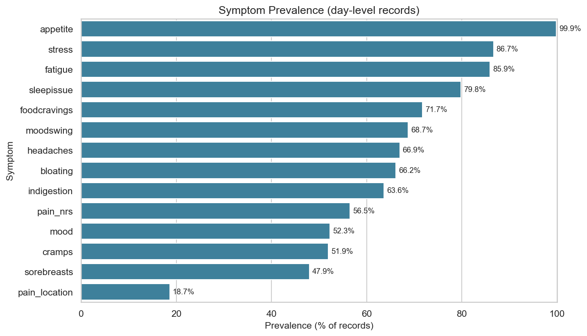
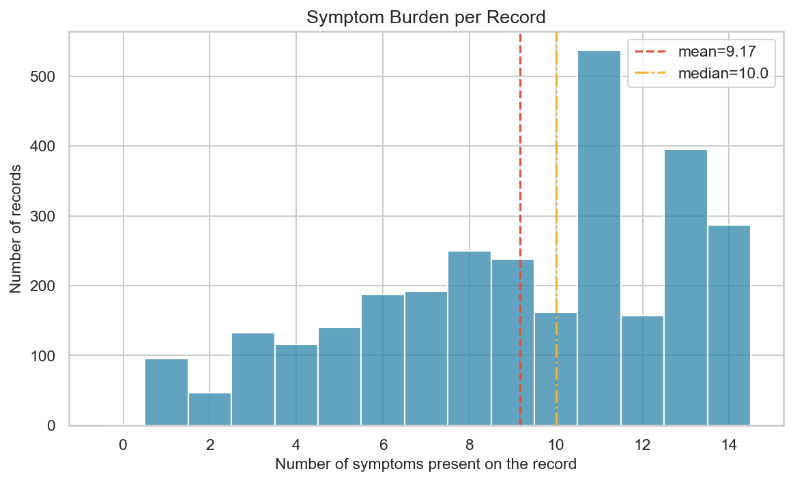
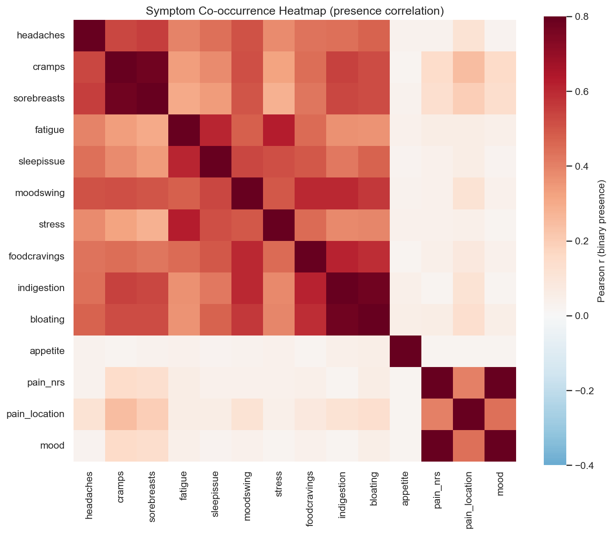
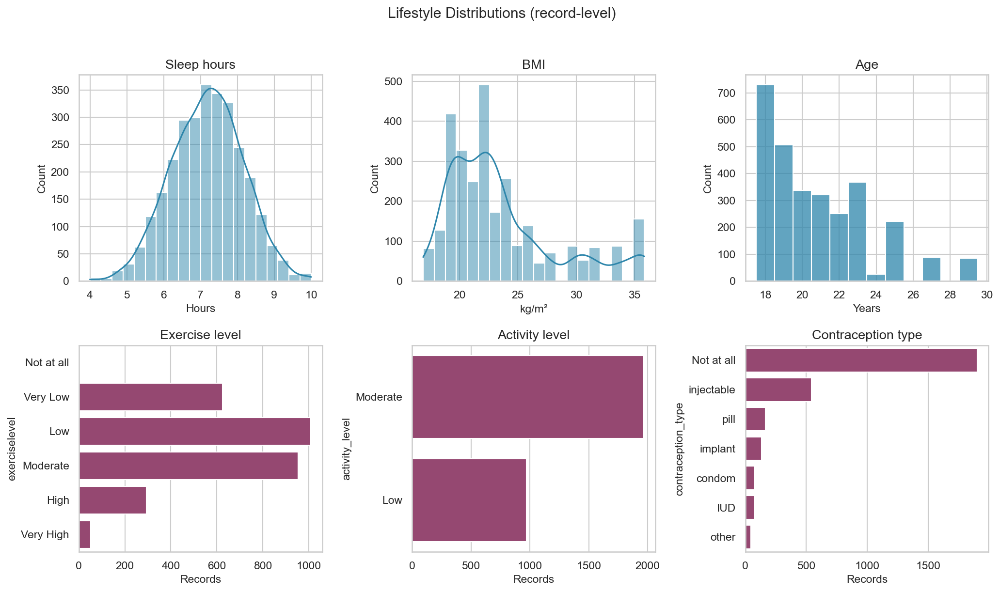
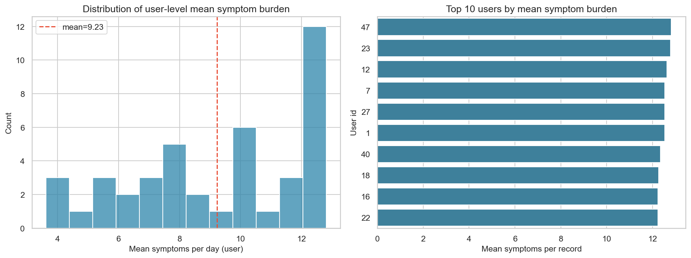
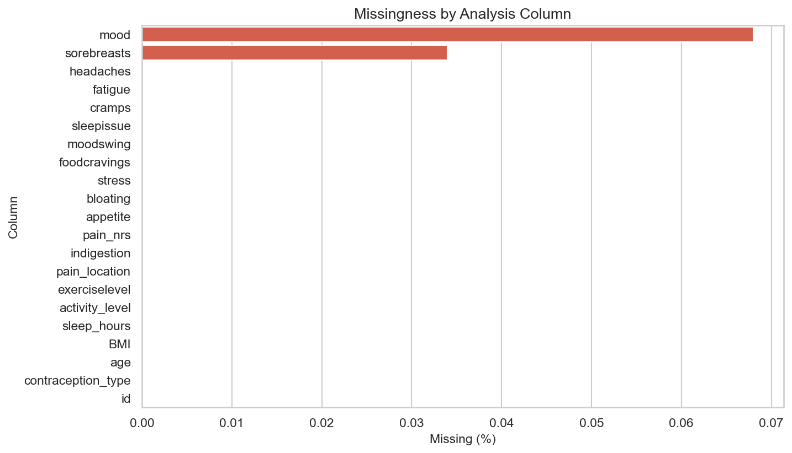

# EDA Phase 2 — Symptoms and Lifestyle

**Dataset:** `cleaned_dataset.csv`  
**Rows:** 2,937 day-level records · **Users:** 42  
**Notebook:** `notebooks/eda_02_symptom_lifestyle.ipynb`  
**Scope:** Descriptive only (no predictive models)

### Presence definitions
- Ordinal symptoms (`headaches` … `appetite`): present if label is not a “Not at all” variant.
- `pain_location`: present if not a “not at all” variant (typos still count as a location).
- `pain_nrs`: notable if ≥ 4 (moderate+). Raw NRS is almost never zero in this file.
- `mood`: disturbance if `Moody` or `sad`.

---

## 1. Dataset validation

All requested symptom and lifestyle columns are present.

Columns with any missing values among the analysis set:

| column | n missing | % |
|--------|-----------|---|
| `mood` | 2 | 0.068% |
| `sorebreasts` | 1 | 0.034% |

Quality flags (not missingness): `pain_nrs > 10` on **1** rows; `mood` contains unexpected labels: `['lower back']`.

---

## 2. Symptom prevalence

| symptom | n present | prevalence |
|---------|-----------|------------|
| `appetite` | 2933 | 99.86% |
| `stress` | 2545 | 86.65% |
| `fatigue` | 2524 | 85.94% |
| `sleepissue` | 2343 | 79.78% |
| `foodcravings` | 2107 | 71.74% |
| `moodswing` | 2018 | 68.71% |
| `headaches` | 1966 | 66.94% |
| `bloating` | 1943 | 66.16% |
| `indigestion` | 1869 | 63.64% |
| `pain_nrs` | 1660 | 56.52% |
| `mood` | 1535 | 52.26% |
| `cramps` | 1525 | 51.92% |
| `sorebreasts` | 1408 | 47.94% |
| `pain_location` | 548 | 18.66% |

### Top 5 most common

| rank | symptom | n | % |
|------|---------|---|---|
| 1 | `appetite` | 2933 | 99.86% |
| 2 | `stress` | 2545 | 86.65% |
| 3 | `fatigue` | 2524 | 85.94% |
| 4 | `sleepissue` | 2343 | 79.78% |
| 5 | `foodcravings` | 2107 | 71.74% |

---

## 3. Symptom burden

| metric | value |
|--------|-------|
| Mean symptoms / record | 9.17 |
| Median symptoms / record | 10.0 |
| Min / max | 0 / 14 |

---

## 4. Co-occurrence

Strongest pairs by **binary correlation**:

| a | b | r | joint % | joint n |
|---|---|---|---------|--------|
| `pain_nrs` | `mood` | 0.909 | 52.06% | 1529 |
| `cramps` | `sorebreasts` | 0.779 | 44.33% | 1302 |
| `indigestion` | `bloating` | 0.773 | 59.69% | 1753 |
| `fatigue` | `stress` | 0.627 | 81.89% | 2405 |
| `foodcravings` | `indigestion` | 0.616 | 59.01% | 1733 |

Strongest pairs by **joint prevalence**:

| a | b | joint % | r |
|---|---|---------|---|
| `stress` | `appetite` | 86.58% | 0.040 |
| `fatigue` | `appetite` | 85.87% | 0.038 |
| `fatigue` | `stress` | 81.89% | 0.627 |
| `sleepissue` | `appetite` | 79.71% | 0.027 |
| `fatigue` | `sleepissue` | 76.98% | 0.603 |

---

## 5. Lifestyle

| variable | mean | median | std | min | max |
|----------|------|--------|-----|-----|-----|
| sleep_hours | 7.19 | 7.21 | 0.97 | 4.00 | 10.00 |
| BMI | 23.54 | 22.44 | 4.79 | 16.88 | 35.84 |
| age | 20.87 | 20.0 | 2.80 | 18 | 29 |

### exerciselevel
| level | n | % |
|-------|---|---|
| `Low` | 1008 | 34.32% |
| `Moderate` | 954 | 32.48% |
| `Very Low` | 624 | 21.25% |
| `High` | 294 | 10.01% |
| `Very High` | 52 | 1.77% |
| `Not at all` | 5 | 0.17% |

### activity_level
| level | n | % |
|-------|---|---|
| `Moderate` | 1967 | 66.97% |
| `Low` | 970 | 33.03% |

### contraception_type
| type | n | % |
|------|---|---|
| `Not at all` | 1898 | 64.62% |
| `injectable` | 541 | 18.42% |
| `pill` | 164 | 5.58% |
| `implant` | 133 | 4.53% |
| `condom` | 79 | 2.69% |
| `IUD` | 77 | 2.62% |
| `other` | 45 | 1.53% |

---

## 6. User-level burden

| metric | value |
|--------|-------|
| Mean of user-mean burden | 9.23 |
| Median user-mean burden | 9.80 |
| Min / max user-mean | 3.62 / 12.81 |

### Top 10 users by mean symptom count

| id | records | mean | median | max |
|----|---------|------|--------|-----|
| `47` | 52 | 12.81 | 13.5 | 14 |
| `23` | 41 | 12.78 | 13.0 | 14 |
| `12` | 70 | 12.63 | 13.0 | 14 |
| `7` | 89 | 12.54 | 13.0 | 14 |
| `27` | 80 | 12.54 | 13.0 | 14 |
| `1` | 74 | 12.53 | 13.0 | 14 |
| `40` | 44 | 12.34 | 13.0 | 14 |
| `18` | 88 | 12.27 | 12.5 | 14 |
| `16` | 50 | 12.24 | 13.0 | 14 |
| `22` | 57 | 12.23 | 13.0 | 14 |

---

## 7. Missingness

Requested fields are nearly complete. Missingness is not the main quality issue; label noise (`pain_location` typos, `mood` leakage, `pain_nrs` > 10) is.

---

## 8. Findings

1. **Systemic/energy symptoms dominate ordinal “any intensity” prevalence** (fatigue, stress, sleep issues, cravings) more than classic pelvic symptoms such as cramps or breast tenderness, which are often logged as “Not at all”.
2. **`appetite` is almost always non-zero**, so ranking it as a “symptom” inflates prevalence; treat it as a lifestyle/appetite-state field in later phases.
3. **Typical day is multi-symptom**: mean burden ≈ 9.2 of 14 flags (median 10). Isolated single-symptom days are not the norm under these encodings.
4. **Co-occurrence vs joint %:** pairs involving two high-base-rate symptoms look common jointly; correlation is the better cue for clustering (e.g. mood-adjacent or GI clusters if they appear in the table above).
5. **Lifestyle cohort is young** (ages 18–29), sleep centers near 7.2 h, BMI mean 23.5. Exercise is mostly Low/Moderate; activity_level is only Low vs Moderate. Most records are `contraception_type = Not at all`.
6. **Users differ in burden** (user-mean range 3.6–12.8). Pooling days without a user lens will mix high-burden and low-burden phenotypes.
7. **Clean next steps (still not ML):** recode `pain_location` typos, cap or audit `pain_nrs` > 10, drop leaked `mood` values, and consider intensity-weighted scores instead of binary presence.

*Generated by `notebooks/eda_02_symptom_lifestyle.ipynb`*
